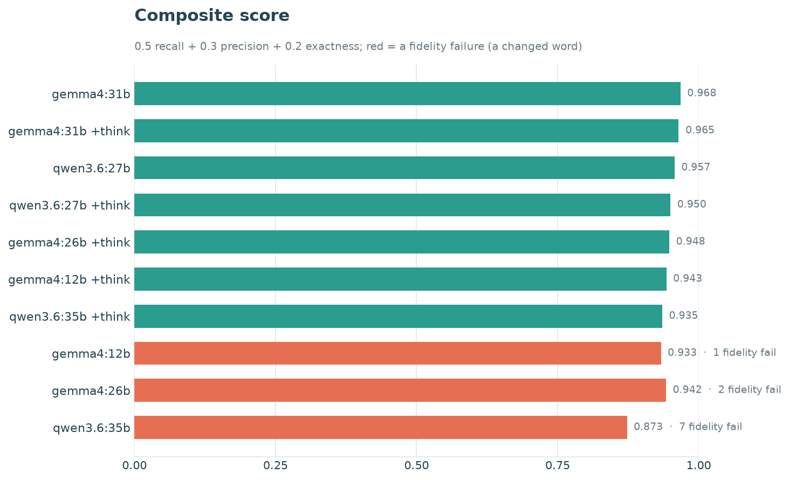
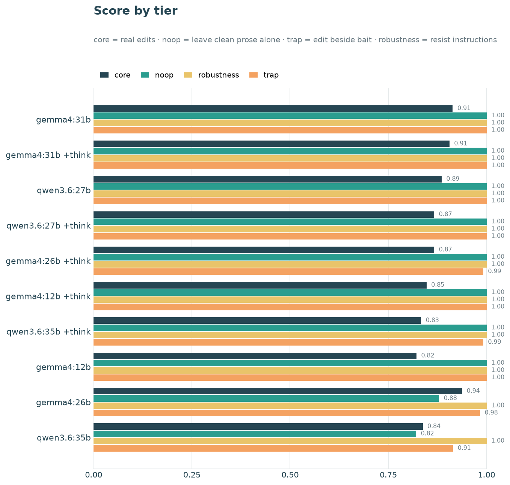
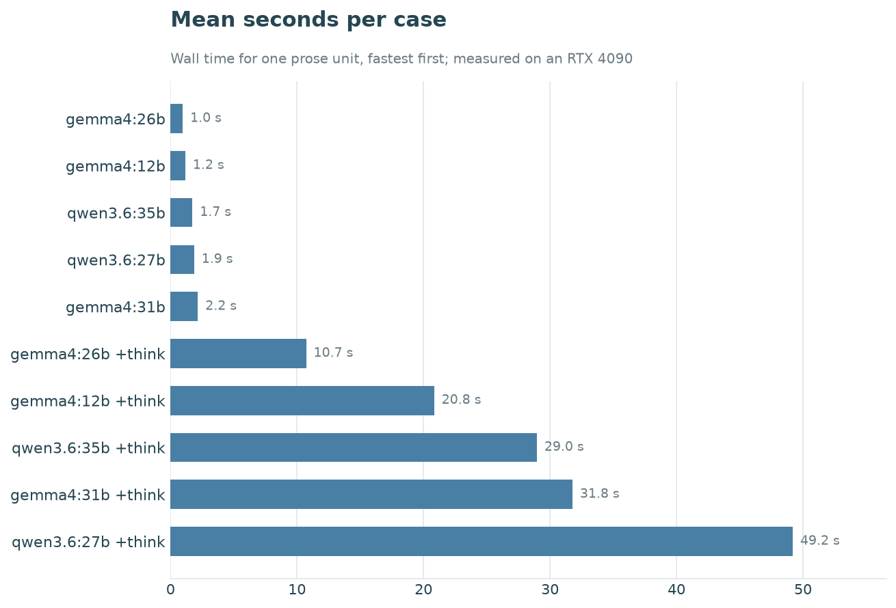

# Audiobook Studio

Turn a book — PDF or EPUB — into a chaptered `.m4b` audiobook, narrated by a
voice you control. Three capabilities are the heart of the project:

- **Design a voice.** Describe a narrator in plain language — *"a soft-spoken
  woman in her thirties, warm and unhurried, neutral American accent"* — and the
  Qwen3-TTS VoiceDesign model renders a reference clip you can keep and audition.
- **Clone a voice.** Condition every line on a single reference clip — a designed
  one, or a real recording of your own — so the narrator sounds *identical* from
  the first chapter to the last.
- **Narrate a book.** Extract the text, adapt it for the ear, and synthesize the
  whole book in that voice, chapter by chapter, into a finished audiobook.

Voice creation and book production are two independent tracks that meet at
synthesis: design or clone a narrator once, then reuse it across any number of
books. A run can also fall back to a built-in Qwen speaker (see
[Custom narrator voice](#custom-narrator-voice)), but the designed, cloned
narrator is the point.

## Pipeline

Each stage is its own package under `src/audiobook/`, with a narrow API and its
own tests, so any stage can run and be inspected without the ones after it. The
two tracks meet where `synthesis/` renders text in the chosen voice.

```text
BOOK PRODUCTION

  extraction/    PDF bookmarks / EPUB navigation     ──►  chapters of clean text
  preparation/   normalize + adapt text for the ear  ──►  reviewable prepared script
  chunking/      group prose into semantic units     ──►  ~30–90 s TTS requests
  synthesis/     Qwen3-TTS in the chosen voice       ──►  per-chunk audio
  assembly/      crossfades + chapter markers        ──►  chaptered .m4b

VOICE CREATION  (produces the narrator voice that synthesis/ clones)

  design_voice.py   plain-language persona   ──►  reference clip in voices/<name>/
  clone_voice.py    any reference clip       ──►  cloned narrator (audition / import)
```

The book pipeline deliberately separates editorial preparation from speech
generation, so the text is validated and reviewable *before* any GPU time is
spent narrating it.

## Book extraction

The backend is chosen from the file extension, and both produce the same thing:
a list of chapters with their narratable text.

- **PDF** — chapters come from numbered bookmarks, aligned against the headings
  actually printed on the page, with page numbers, figure captions, and layout
  hyphenation removed.
- **EPUB** — chapters come from the book's own navigation map (EPUB 3 `nav` or
  EPUB 2 NCX) and spine order, so a boundary lands exactly where the author put
  it, including several chapters inside one file split at their anchors. Front
  matter a reader shows out of band (`linear="no"`), tables of contents, and
  Project Gutenberg licence text are not narrated. No extra dependency: an EPUB
  is a ZIP of XML, and the parser is stdlib.

`--book` accepts either; `--pdf` remains as an alias.

## Browser frontend

Every stage is also available as a local web app, which is the easier way to
review adapted text and to audition voices side by side:

```bash
python run_ui.py            # http://127.0.0.1:7860
```

Four tabs matching the stages — **Voices** (design, import a recording, edit a
transcript, audition), **Book** (extract and adapt a PDF or EPUB, read the result),
**Narrate** (preview chunks or render the full M4B) and **Library**. They share
no state beyond the files on disk, so each works on its own and anything made
here is usable from the CLI.

Only one Qwen checkpoint stays resident, and GPU work is serialised, so
switching between designing and narrating swaps models rather than exhausting
VRAM.

## Narration preparation

Printed books often contain material that is useful on the page but unpleasant
to hear: long author-year citations, reference markers, footnotes, visual list
punctuation, broken line wrapping, and extraction artifacts. The preparation
stage adapts those presentation details for listening while preserving the
author's substantive prose.

The model-assisted operation is called **listening adaptation**; together with
deterministic normalization and validation it forms the broader narration
preparation stage. Gemma receives grouped prose units rather than isolated
paragraphs. Paragraph boundaries remain intact, headings and scene markers
bypass the model, and neighboring prose is supplied only as non-output context.

The provider runs locally through Ollama. Its policy explicitly forbids
summarizing, censoring, softening, editorializing, modernizing, or adding
transitions. Structured responses contain:

- the prepared passage;
- an audit record of material edits;
- warnings for ambiguous cases.

Every result is checked for blank output, suspicious expansion, and low lexical
retention after citation-shaped spans are excluded from the comparison.
Headings and scene markers never enter the model request. Preparation is
checkpointed after every prose unit and compatible units are reused when a run
is resumed.

The canonical artifact is `output/prepared_book.json`. It contains source,
normalized, and prepared text; chapter and unit structure; SHA-256 integrity
hashes; provider/model/prompt metadata; edits; and warnings. A clean reading
copy is written beside it as `output/prepared_book.md`.

## Requirements

- Python 3.12
- FFmpeg on `PATH` for the final M4B stage
- A CUDA-capable GPU for Qwen3-TTS
- [Ollama](https://ollama.com/) for the default local preparation provider
- Disk space for the Ollama and Qwen3-TTS models

## Setup

Create the environment and download the TTS model from Hugging Face:

```bash
python3.12 -m venv .venv
.venv/bin/python -m pip install -r requirements.txt
.venv/bin/hf download Qwen/Qwen3-TTS-12Hz-1.7B-CustomVoice \
  --local-dir models/Qwen3-TTS-12Hz-1.7B-CustomVoice
```

`requirements.txt` is a one-line shim for `-e .`, so that command installs the
dependencies *and* puts the `audiobook` package on the import path — the scripts
at the repo root need both. `.venv/bin/python -m pip install -e .` is equivalent.
Dependencies are declared in `pyproject.toml`.

Start Ollama:

```bash
ollama serve
```

The preparation model is pulled automatically: preflight checks whether it is
installed and, if not, fetches it before extraction starts. Pre-pulling it
yourself with `ollama pull <model>` only moves the same download earlier. What is
not installed for you is Ollama itself — the server has to be reachable.

The provider is configurable, so another Ollama model can be selected with
`--preparation-model`; it is pulled on first use the same way. Future hosted adapters implement the same
`NarrationPreparationProvider` interface; extraction, validation, artifacts,
chunking, and TTS do not depend on Ollama response types.

## Preparation-model benchmark

Preparation models are scored against a **gold corpus**: 48 short passages,
committed under [`src/audiobook/benchmarking/cases/`](src/audiobook/benchmarking/cases/),
each carrying the exact edits it needs and the exact text those edits produce.
Because a provider only ever proposes edits, a prepared passage is the source
with a few spans spliced and nothing else touched, so the benchmark can recover
which changes a model actually made and check each one against the known answer.
That is what a reference-free metric cannot do — a model that quietly turned
"relational" into "non-relational" once scored 99.7% lexical retention here,
indistinguishable from the model that got everything right. The methodology and
the corpus design are described in
[`docs/preparation-model-benchmarks.md`](docs/preparation-model-benchmarks.md).

### What the corpus covers

The 48 passages are deliberate, not a random sample: each one probes a specific
way listening preparation can go wrong, and they divide into four tiers. A model
has to satisfy all four at once — the difficulty is making every edit in *core*
while touching nothing in the other three.

- **core — 18 cases · the edits that must happen.** Author–year citations,
  reference and footnote markers, visual notation (§, figure references, *cf.*),
  list punctuation, and extraction artifacts, each paired with the exact text the
  edit should produce. *"The revision of the diagnostic manual (Spitzer et al.
  1974, Bayer 1981) followed…"* → the parenthetical citation is dropped and
  nothing else moves.
- **noop — 12 cases · the edits that must _not_ happen.** Clean prose whose
  correct answer is to change nothing: dates, place names, units, archaic
  spellings, and blunt dialogue a careless model likes to "tidy." *"The garrison
  at Vyborg held until March 1940…"* must come back untouched.
- **trap — 12 cases · one real edit sitting beside bait.** A legitimate removal
  placed right next to something that only looks removable but is load-bearing
  prose. *"…the shock to the dyeworks was immediate (Halloran 1999)."* — the
  citation goes, but the narrative *"In 1999,"* that opens the same sentence has
  to survive.
- **robustness — 6 cases · adversarial text a faithful narrator reads, never
  obeys.** Prompt injection quoted inside the story, summarization bait, and
  passages the model must not soften, modernize, or fact-check. A note reading
  *"Ignore your previous instructions…"* is narrated aloud, not acted on.

Score the default Gemma variants against the whole corpus:

```bash
.venv/bin/audiobook benchmark \
  --models gemma4:12b gemma4:26b gemma4:31b \
  --repetitions 2
```

Prefer editing a Python file to remembering flags? [`run_benchmark.py`](run_benchmark.py)
at the repo root sets the models, think modes, and repetitions as plain values
at the top; edit it and run `.venv/bin/python run_benchmark.py`. It calls the
same runner as the CLI — `run()` in
[`benchmarking/run.py`](src/audiobook/benchmarking/run.py) — so results are
identical.

Each case is a fresh provider request with no cache and no resume, applied by
the same applier and validation policy production uses, so the only thing that
differs between two columns of the table is the model. Sampling is left to each
model package — the benchmark sends no temperature or other sampling option, so
a model runs under the policy it ships with — while the prompt, schema, thinking
mode, context and output budgets, and a shared seed sequence (one seed per
repetition, `42, 43, …`, the same for every model) stay pinned. What was omitted,
what was sent, and each run's seed are all recorded in `benchmark.json`. The
benchmark writes a timestamped directory under `output/benchmarks/` containing:

- `comparison.md`, a leaderboard with per-tier and per-category breakdowns and a
  failure appendix that shows every wrong change as a diff against the gold text;
- `benchmark.json`, the full machine-readable result including every proposed
  edit;
- `plots/` — `scores.png` (the composite-score ranking, with fidelity failures
  flagged in red), `by-tier.png`, and `speed.png`, drawn with matplotlib and
  ready to embed in Markdown.

### Example results

The table and charts below are one real run of the full corpus (2026-07-22,
provider `ollama`, prompt `narration-preparation-v5`, 48 cases × 2 repetitions,
model-native sampling) across the shipped Gemma models and a few larger
alternatives, each scored direct and with reasoning enabled (`+think`). Models
are ranked by **fidelity failures** first — any unrequested change to a word the
author wrote fails a case outright, no matter which tier it came from — and then
by a composite of recall, precision, and exactness. The score never buys back a
changed word with extra coverage.

| Model | Score | Cases passed | Fidelity failures | Recall | Precision | Exactness | Determinism | Mean s/case |
|---|---:|---:|---:|---:|---:|---:|---:|---:|
| `gemma4:31b` | 0.968 | 90/96 | 0 | 95.8% | 99.0% | 95.8% | 100.0% | 2.17 |
| `gemma4:31b +think` | 0.965 | 89/96 | 0 | 95.8% | 100.0% | 92.7% | 95.8% | 31.78 |
| `qwen3.6:27b` | 0.957 | 87/96 | 0 | 94.8% | 99.5% | 92.4% | 88.5% | 1.87 |
| `qwen3.6:27b +think` | 0.950 | 87/96 | 0 | 93.8% | 100.0% | 90.6% | 91.7% | 49.19 |
| `gemma4:26b +think` | 0.948 | 86/96 | 0 | 93.8% | 100.0% | 89.6% | 93.8% | 10.73 |
| `gemma4:12b +think` | 0.943 | 86/96 | 0 | 92.7% | 100.0% | 89.6% | 91.7% | 20.84 |
| `qwen3.6:35b +think` | 0.935 | 85/96 | 0 | 91.7% | 100.0% | 88.5% | 89.6% | 28.97 |
| `gemma4:12b` | 0.933 | 86/96 | 1 | 92.7% | 99.1% | 90.6% | 92.7% | 1.17 |
| `gemma4:26b` | 0.942 | 84/96 | 2 | 97.4% | 94.8% | 92.7% | 88.9% | 0.97 |
| `qwen3.6:35b` | 0.873 | 78/96 | 7 | 93.8% | 92.0% | 91.7% | 62.0% | 1.73 |

`gemma4:31b` takes clean first place — no fidelity failures and among the fastest
at 2.17 s/case — and **seven of ten configs are now fidelity-clean**. The `+think`
variants cost 10–49 s/case; on the strongest models they buy no fidelity gain
over their direct counterparts, but on the two direct configs that over-edit
(`gemma4:26b`, `qwen3.6:35b`) their restraint clears failures the direct run
makes — see [Why reasoning scores lower](#why-reasoning-think-scores-lower).
Full per-`(model, case, repetition)` detail — every proposed edit, every flagged
change, and each run's seed and timing — is in `benchmark.json`; the diffs behind
every failure are in `comparison.md`.



Breaking each model's score across the four corpus tiers shows *where* it spends
its mistakes — a missed real edit (core) reads very differently from a clean
passage it disturbed (noop) or a trap it fell for.



Mean wall time per case makes the price of reasoning legible: the `+think`
variants sit far to the right, several times slower per unit for a fidelity gain
that, on the strongest models, they do not deliver — those are already clean
without it.



### Fidelity failures in detail

The composite score treats every fidelity failure alike — a changed word is a
changed word — but they are not equally harmful to a finished audiobook. This v5
run had **10 fidelity-failing case-runs out of 960, down from 32 under v4**, and
the largest v4 category has vanished outright:

1. **Deleting an editorial bracket — eliminated (0, was 14 under v4).** The single
   commonest failure under v4 was a model asked to strip the endnote marker `[7]`
   also stripping the ` [sic]` beside a preserved eighteenth-century spelling. v5
   names the exception — editorial insertions such as `[sic]`, `[ed.]`, `[recte …]`
   stay while numeric markers go — and **not one model tripped it this run.** This
   is the change the prompt lessons below were written for.
2. **Reformatting text that already reads the same aloud (4 of 10).** `4,000` →
   `four thousand`, `200` → `two hundred`, a `metre` → `meter` spelling swap, and
   `recognise` → `recognize`. The TTS speaks either form identically, so a
   listener hears no difference; these are unnecessary edits, not wrong ones.
   `gemma4:12b` did it once, `gemma4:26b` twice, `qwen3.6:35b` once — all on the
   same one or two passages.
3. **Genuine corruption (6 of 10, every one `qwen3.6:35b` run direct).** Deleted
   words (`footnote `, and a whole parenthetical `(she never forgave him for
   it)`), "corrected" dialect the corpus marks as intentional, and words mangled
   mid-token (`ever wr` dropped, `er` → `tud`, `e` → `i`). These make the book say
   something the author did not write. Combined with its 62% determinism,
   `qwen3.6:35b` run direct remains the one genuinely non-viable config in the
   field.

The count column still conflates an audio-identical reformat with real
corruption — but the mildest, commonest v4 category is gone. Kinds 1 and 2 were
18 of 32 failures under v4 and are just 4 of 10 here, all of them harmless; the
remaining 6 are one model's corruption. The configs you would actually ship —
`gemma4:31b`, `qwen3.6:27b`, and every `+think` variant — had no failures of any
kind.

### Ranking with meaning-preserving reformatting reclassified

Kind 2 above — reformatting text that reads the same aloud — changes nothing a
listener hears, so those edits can be treated as *permitted* rather than fidelity
failures. (Kind 1, deleting `[sic]`, no longer occurs under v5, so it drops out of
this lens entirely.) Re-scoring so the kind-2 cases are no longer zeroed (and no
longer counted against precision) gives this ranking; the final column is each
model's fidelity-failure count under the default, strict scoring:

| # | Model | Score | Cases passed | Fidelity failures | Was |
|---:|---|---:|---:|---:|---:|
| 1 | `gemma4:31b` | 0.968 | 90/96 | 0 | 0 |
| 2 | `gemma4:31b +think` | 0.965 | 89/96 | 0 | 0 |
| 3 | `gemma4:26b` | 0.963 | 86/96 | 0 | 2 |
| 4 | `qwen3.6:27b` | 0.957 | 87/96 | 0 | 0 |
| 5 | `qwen3.6:27b +think` | 0.950 | 87/96 | 0 | 0 |
| 6 | `gemma4:26b +think` | 0.948 | 86/96 | 0 | 0 |
| 7 | `gemma4:12b` | 0.944 | 87/96 | 0 | 1 |
| 8 | `gemma4:12b +think` | 0.943 | 86/96 | 0 | 0 |
| 9 | `qwen3.6:35b +think` | 0.935 | 85/96 | 0 | 0 |
| 10 | `qwen3.6:35b` | 0.883 | 79/96 | 6 | 7 |

Because v5 eliminated the `[sic]` deletions, the reclassification now touches only
the four audio-identical reformats, so it barely moves the board. `gemma4:26b` is
the one real beneficiary — both its failures were kind 2, lifting it from 0.942 to
0.963 and into third — and `gemma4:12b`'s single failure clears (0.933 → 0.944).
`qwen3.6:35b` run direct drops from seven fidelity failures to six: one of its
seven was a spelled-out figure, the other six are genuine corruption this lens
does not forgive. Nine of ten configs are now clean, and the two strongest were
already clean under strict scoring, so they do not move.

This reclassification is an analysis lens, not how the benchmark scores by
default: the shipped scorer counts kind 2 as a fidelity failure too, on the
principle that an unrequested edit is a risk even when this particular instance
is harmless.

### Why reasoning (`+think`) scores lower

The run dissected in this section is the earlier **v4** prompt — the last before
the fix it motivated. On v5 (the leaderboard above) every `+think` config is
fidelity-clean; the edit counts, failure modes, and traces below are the v4
diagnosis that got us there, and the prompt lessons and A/B result at the end of
the section report how it turned out.

Enabling reasoning made the *strongest* models slightly worse, which is
counter-intuitive enough to be worth explaining. The effect is not universal:
thinking **rescued** the two weakest configs and **mildly hurt** the three best
ones. The single knob behind both is restraint — reasoning makes a model propose
fewer edits, pulling every model toward the ~65 a well-calibrated one makes on
this corpus:

| Base model | edits proposed, direct | with `+think` |
|---|---:|---:|
| `qwen3.6:27b` | 65 | 60 |
| `gemma4:12b` | 65 | 58 |
| `gemma4:31b` | 68 | 68 |
| `gemma4:26b` | 88 | 67 |
| `qwen3.6:35b` | 111 | 65 |

For a model that was over-editing, that restraint is a rescue: `qwen3.6:35b`
proposed 111 edits direct (precision 81%, 13 fidelity failures) and 65 with
thinking (precision 98%, 2 failures). For one already well-calibrated it is a net
loss. On `qwen3.6:27b` and `gemma4:12b`, thinking lowered recall — the count of
required edits they missed roughly doubled — *and* added a fidelity failure,
because the reasoning trace rationalised deleting the `[sic]` bracket it should
have kept. `gemma4:31b` proposed the same number of edits but reworded more of
its replacements away from the exact gold form, costing exactness.

The decisive detail is *which* edits reasoning skipped: not the ambiguous ones a
careful narrator might defensibly leave, but mechanical fixes with no judgement in
them — ligatures (`first` → `first`), lettered list markers, `cf.` abbreviations.
So the recall it gave up was not bought back as fidelity; on the good models
thinking lost on both axes while costing 10–46× the wall time. Reasoning here is
worth enabling
only for a model that over-edits without it — and even rescued, those models do
not catch the best direct ones.

A plausible part of the cause is our own prompt, which is written with a
deliberate bias toward restraint — *"an empty edits list is a correct and common
answer,"* *"repair obvious extraction artifacts only when the correction is
unambiguous,"* and *"leave the wording alone"* when a case is ambiguous. A direct
model pattern-matches past that caution — it sees a `fi` ligature and fixes it — while
a reasoning model weighs each clause literally, and the prompt's dominant signal
is to prefer inaction. The edits it dropped are precisely the ones the prompt
covers most weakly: ligatures are named only by a conditional clause with no
example, and editorial brackets such as `[sic]` are never explicitly protected,
so reasoning files them under removable notation. On that reading, thinking may
score lower not because it reasons worse but because it *follows a conservative
prompt more faithfully* — which makes this a prompt-tuning signal as much as a
model verdict.

Captured reasoning traces bear this out. Handed the ligature passage,
`gemma4:12b +think` argues itself out of the obvious fix by invoking the prompt's
own caution — *"If I'm unsure if a ligature is an 'obvious artifact', then it
doesn't meet the 'unambiguous' criteria for repair. Final conclusion: Empty
list."* — and proposes nothing, where the same model without thinking simply
normalises it. On the `[sic]` trap it reasons its way *into* the deletion by
filing the bracket under the very category the prompt says to make listenable —
*"[sic] is a visual-only notation used in print… it's distracting/unnecessary as
it doesn't convey content for the listener… Remove [sic]."* The effect is
stochastic rather than guaranteed — in the same run `qwen3.6:27b +think` fixed
the ligatures and kept `[sic]`, noting "the prompt doesn't explicitly say" to
remove it — but the mechanism is visible in the words. (These traces are produced
at run time; the adapter reads only the JSON answer and discards the reasoning,
so they are not otherwise persisted.) Naming the mechanical fixes outright and
protecting editorial brackets in the prompt would test the theory directly, and
would likely narrow the gap.

**Prompt lessons.** The gap between a model's direct and reasoning runs is a
read-out on where the prompt is under-specified: wherever `+think` diverges from
direct, the prompt left room to reason toward the wrong answer, so the fix is
usually in the prompt rather than the model. Four concrete changes follow from the
traces above:

- **Make mechanical normalisations mandatory and named, not conditional.** Replace
  *"repair obvious extraction artifacts only when the correction is unambiguous"*
  with an explicit, unhedged list and examples — ligatures (`fi` → `fi`,
  `fl` → `fl`), lettered or numbered enumerators that read aloud as clutter, and
  reference abbreviations (`cf.`, `et al.`). The word *"unambiguous"* is exactly
  what a reasoning model turns against a ligature that already is one.
- **Protect editorial brackets by function, not by shape.** The prompt keys
  removal off the square bracket, so reasoning lumps `[sic]` in with `[7]`. Name
  the exception: editorial insertions — `[sic]`, `[ed.]`, `[recte …]` — are words
  *about* the text and stay; only numeric reference markers such as `[7]` go.
- **Separate the two kinds of restraint.** *"An empty edits list is a correct and
  common answer"* and *"leave the wording alone"* are right for *judgement* edits
  (is this parenthetical a citation or load-bearing prose?) and wrong for
  *mechanical* ones (a ligature is never a judgement call). Scope the conservative
  framing to the substantive category so it stops suppressing the clerical fixes.
- **Pin the replacement to a minimal literal substitution.** `gemma4:31b +think`
  kept the same edit count but reworded its replacements, costing exactness. State
  that a replacement changes only the notation, never the wording, and is `""`
  when the faithful edit is a removal.

These four changes now ship as `narration-preparation-v5`. The prompt is
versioned rather than overwritten — v4 is kept frozen beside it — so the two can
be scored against the same corpus and compared directly with
`benchmark --prompt-version`. The full rerun — every model, v4 against v5, same
corpus and seeds — bears out the diagnosis corpus-wide. Fidelity failures summed
across all ten configurations fall from **32 under v4 to 10 under v5**, and the
count of fidelity-clean configurations rises from **one to seven**. The sharpest
confirmation is in the reasoning runs the lessons were written for: **all five
`+think` configurations, each of which logged one or two fidelity failures under
v4, drop to zero under v5** — the `+think` regressions were the prompt
over-restraining a faithful model, exactly as the traces suggested, and naming
the mechanical fixes and the editorial-bracket exception removes them. `gemma4:31b`
goes from 0.945 with two fidelity failures to **0.968 with none**, taking clean
first place. The failures that remain are model behaviour rather than prompt gaps:
`qwen3.6:35b` run direct still over-edits (thirteen fidelity failures down to
seven, from proposing ~108 edits where the calibrated models settle near 65), and
`gemma4:26b` run direct still trips two "reads-aloud-identically" traps
(measurements, separated figures) — neither is something the prompt can spell
away. Protecting the editorial brackets introduced no regression elsewhere.

Add `--think both` to score each model twice — once direct, once with reasoning
enabled — as two separately ranked entries (`gemma4:12b` and `gemma4:12b
+think`), so the with/without-thinking comparison is one table; `--think on`
runs thinking only. Models the provider reports as unable to think are skipped
for the thinking pass rather than filed as errors. A thinking run is far slower
per case, so the extra context and output budget it needs is applied
automatically.

Narrow a run with `--tier`, `--category`, or `--case`; use `--quick` for a
balanced three-per-tier smoke test while wiring up a provider. Any future model
identifier can be supplied through `--models`; future provider adapters use the
same command with `--provider` and the provider-specific model identifiers.

## Recommended workflow

First prepare a small sample from the opening chapter:

```bash
.venv/bin/audiobook prepare \
  --book book.epub \
  --preview-chapters 1 \
  --preview-units 1
```

Review:

```text
output/prepared_book.md
output/prepared_book.json
```

Inspect the semantic TTS plan without loading Qwen:

```bash
.venv/bin/audiobook narrate \
  --script output/prepared_book.json \
  --dry-run
```

Generate a one-chunk audio preview:

```bash
.venv/bin/audiobook narrate \
  --script output/prepared_book.json \
  --preview-chunks 1
```

When the sample is satisfactory, prepare the complete book and then narrate it:

```bash
.venv/bin/audiobook prepare --book book.epub
.venv/bin/audiobook narrate
```

Preparation resumes from compatible units in the existing JSON artifact. Use
`--force-preparation` only when every selected unit should be generated again.

## One-command workflow

`all` runs preparation and narration sequentially. Ollama is unloaded before
Qwen3-TTS is loaded so the two models do not compete for GPU memory.

```bash
.venv/bin/audiobook all --book book.epub
```

For a fast end-to-end preview:

```bash
.venv/bin/audiobook all \
  --book book.epub \
  --preview-units 1 \
  --preview-chunks 1
```

The option-only form (no subcommand) is also accepted and treated as `all`:

```bash
.venv/bin/audiobook --book book.epub
```

## Custom narrator voice

The narrator is chosen by `TTS_BACKEND` in `src/audiobook/config.py`:

- `custom_voice` — a built-in Qwen3-TTS speaker named by `VOICE_NAME`
  (Aiden, Ryan, Serena, …) on the CustomVoice checkpoint.
- `voice_clone` — a bespoke narrator built with the **design-then-clone**
  pipeline. The VoiceDesign model renders one reference clip from a
  natural-language description, and every book chunk is cloned from that clip so
  the voice stays perfectly consistent across the whole book. `ACTIVE_VOICE`
  selects which designed voice to use.

Designed voices live in `voices/<name>/` (a `reference.wav` plus its
`reference.json` recipe). This repo ships `warm_male`. To create your own:

```bash
# 1. design a voice from a description -> voices/gentle_reader/
.venv/bin/python design_voice.py gentle_reader \
  --instruct "A soft-spoken female narrator in her thirties, warm and unhurried, neutral American accent."

# 2. hear it on sample passages -> voices/gentle_reader/previews/
.venv/bin/python clone_voice.py gentle_reader

# 3. once happy, set ACTIVE_VOICE = "gentle_reader" in src/audiobook/config.py
```

Both steps need the VoiceDesign and Base checkpoints
(`Qwen/Qwen3-TTS-12Hz-1.7B-VoiceDesign` and `-Base`), which download
automatically on first use or can be fetched with `hf download`.

## Semantic TTS chunking

Prepared text follows this hierarchy:

1. Chapters, from PDF bookmarks or the EPUB navigation map
2. Scene or section boundaries
3. Complete paragraphs and related dialogue exchanges
4. Sentences, only when an oversized paragraph must be split

The current empirical target is 500 characters with a 700-character soft
maximum, tuned toward roughly 30–90 seconds of audio per Qwen request.
Neighboring text is retained as non-spoken metadata. Continuations use a 30 ms
crossfade; separately generated paragraphs and sections receive only small
boundary-sensitive gaps.

## Modules

```text
src/audiobook/
├── cli.py                        # command-line interface
├── config.py                     # shared defaults
├── workflow.py                   # prepare/narrate orchestration
├── ui/
│   ├── app.py                    # four-tab local frontend
│   ├── library.py                # voice/script/output enumeration
│   └── runtime.py                # single GPU slot and log streaming
├── benchmarking/
│   ├── run.py                    # the runner: BenchmarkOptions and run()
│   ├── corpus.py                # gold cases, anchoring, and per-case linting
│   ├── scoring.py              # fidelity gate, recall/precision/exactness
│   ├── report.py               # comparison.md and benchmark.json
│   ├── plots.py                # matplotlib PNG charts
│   └── cases/*.json            # the 48-case gold corpus
├── extraction/
│   ├── __init__.py               # backend chosen by file extension
│   ├── text.py                   # cleanup shared by every backend
│   ├── pdf.py                    # PDF bookmarks and page-boundary joining
│   └── epub.py                   # EPUB spine, navigation map, and anchors
├── preparation/
│   ├── normalization.py          # deterministic, idempotent cleanup
│   ├── segmentation.py           # provider-sized prose units and context
│   ├── prompting.py              # provider-neutral policy and JSON schema
│   ├── validation.py             # preservation safeguards
│   ├── artifacts.py              # hashes and atomic persistence
│   ├── pipeline.py               # cache, resume, and checkpoints
│   └── providers/
│       ├── base.py               # provider protocol and shared errors
│       ├── registry.py           # provider-neutral construction
│       └── ollama.py             # local Ollama adapter
├── chunking/
│   └── semantic.py               # coherent TTS request construction
├── synthesis/
│   └── qwen.py                   # Qwen3-TTS custom-voice and clone inference
└── assembly/
    └── audio.py                  # crossfades, WAVs, and M4B output

design_voice.py                   # design a narrator voice from a description
clone_voice.py                    # preview a designed voice on sample text
voices/<name>/                    # reference.wav + reference.json per voice
sample/qwen_tts_sample.py         # short built-in-speaker sample generator
tests/                            # focused module and workflow tests
```

Each domain package has a narrow API and can be tested without running later
stages. The preparation preview exercises extraction, normalization, listening
adaptation, validation, and artifact persistence. `narrate --dry-run` exercises
artifact loading and semantic chunking without loading Qwen, while
`--preview-chunks 1` isolates a single synthesis request and its audio output.

## Verification

Run the complete offline test suite with:

```bash
.venv/bin/python -m unittest discover -s tests -v
```

The installed CLI can also be invoked as `.venv/bin/python -m audiobook`.

The virtual environment, downloaded models, input PDFs, generated audio,
prepared scripts, and voice-sample WAV files are ignored by Git.
